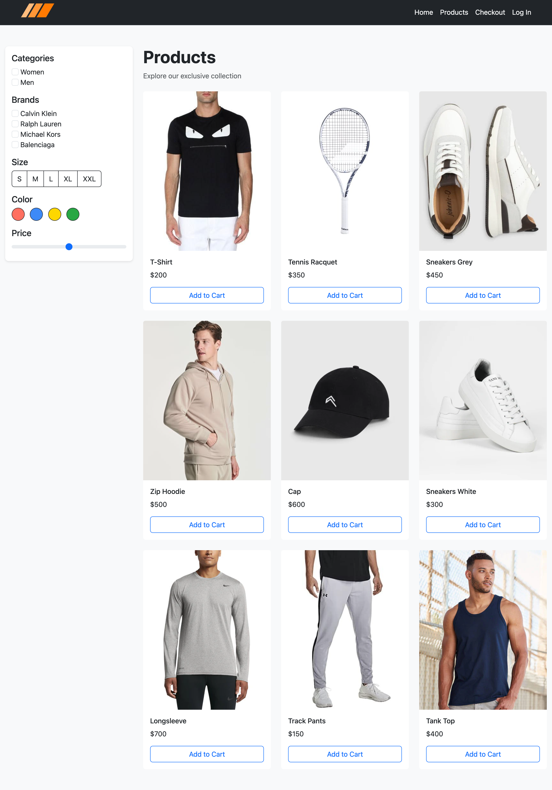
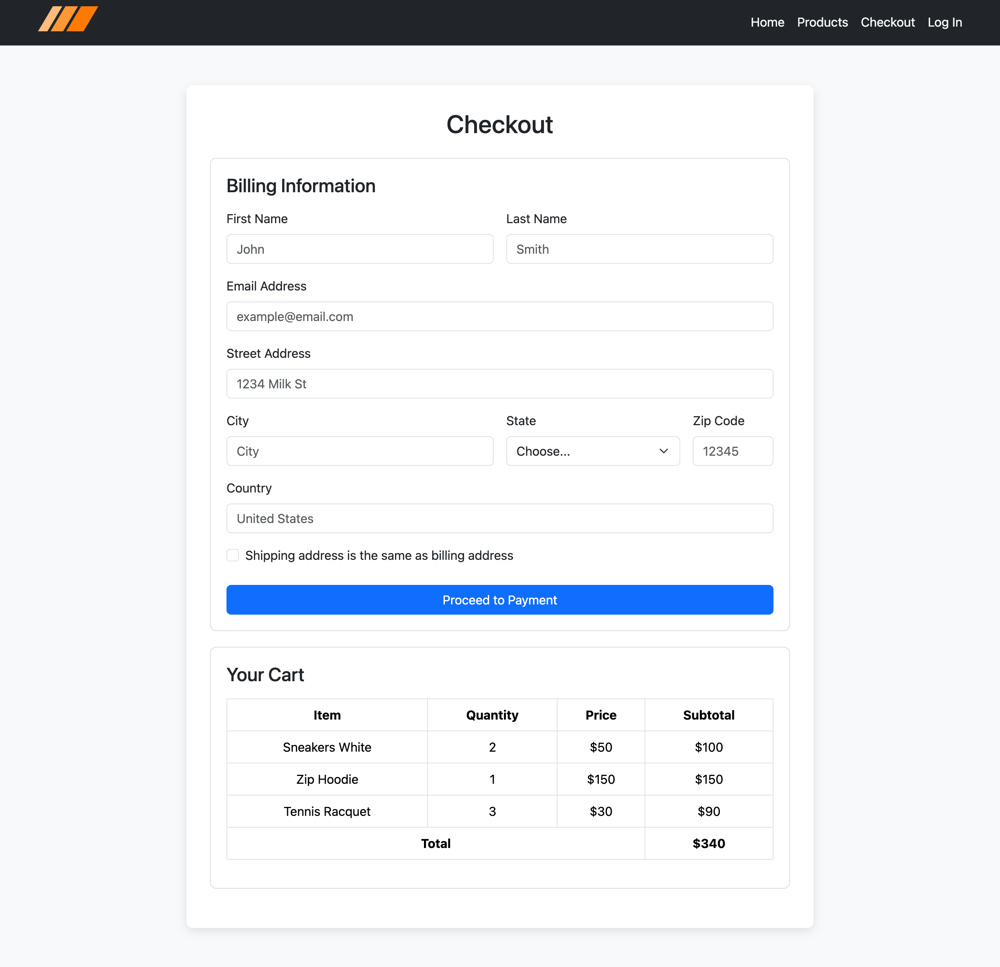
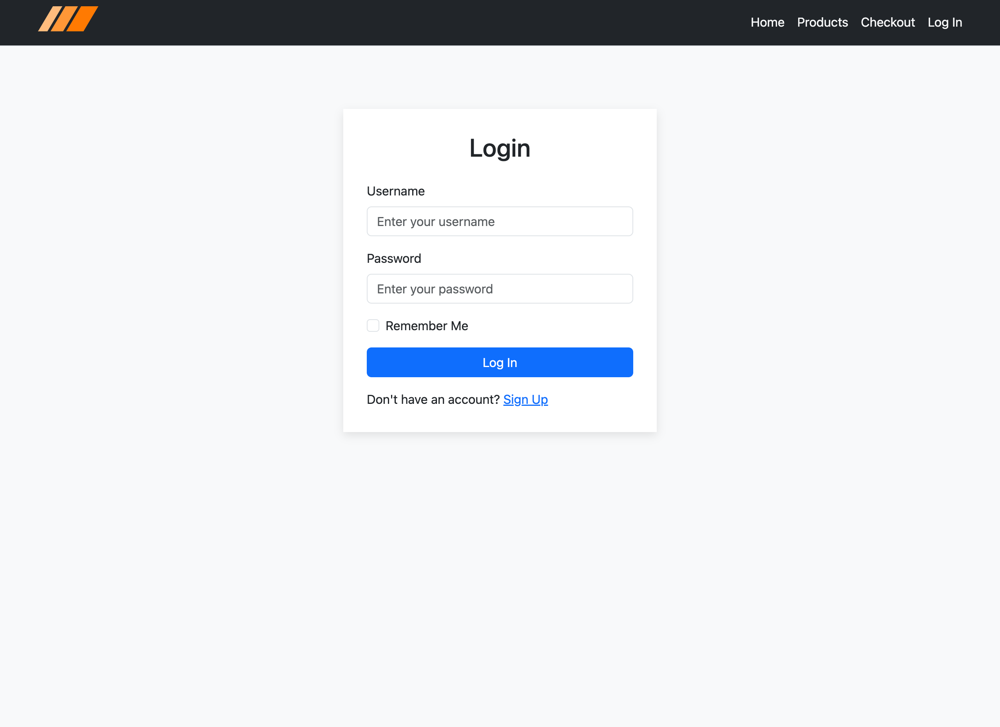
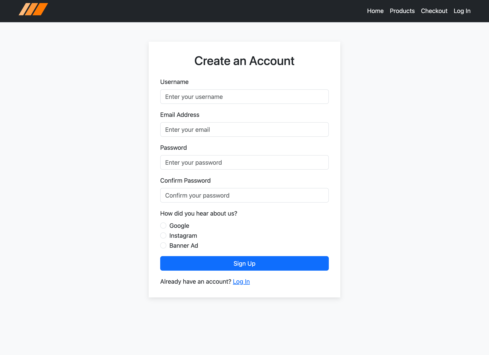

# Sportswear E-commerce Store

## Project Overview

This project is a fully responsive sportswear e-commerce website designed for showcasing a Fall 2024 collection. It consists of five primary pages: **Home**, **Products**, **Checkout**, **Login**, and **Signup**. The website is built using HTML, CSS, and Bootstrap for layout and styling. The goal of the project is to provide a visually appealing and user-friendly interface for customers looking to browse and purchase sportswear products.

## Table of Contents

- [Features](#features)
- [Pages](#pages)
- [Technologies Used](#technologies-used)

## Features

- Responsive design for mobile and desktop views.
- Navigation bar with links to all pages.
- Product cards with images, titles, and category buttons.
- User login and signup forms with input validation.
- Checkout page with sample product table and form inputs.
- Detailed product descriptions and attractive UI for enhanced user engagement.

## Pages

### Home Page:

- Features a hero banner and a collection overview for the Fall 2024 lineup.
- Includes a brief description of the collection, along with links to various product categories.

### Products Page:

- Displays a grid of sportswear items with images, names, and prices.
- Contains sorting and filtering options for size, brand, and color.

### Checkout Page:

- A form-based page where users can enter billing and shipping information.
- Displays a table summarizing the items in the user's cart.

### Login Page:

- Contains fields for username and password with a "Remember Me" option.

### Signup Page:

- Form with inputs for username, email, and password confirmation.
- Includes a radio button for selecting how the user heard about the store.

## Technologies Used

- **HTML5**: Structuring the web pages and content.
- **CSS3**: Styling and responsive design.
- **Bootstrap 5**: For layout, components, and responsive grid system.
